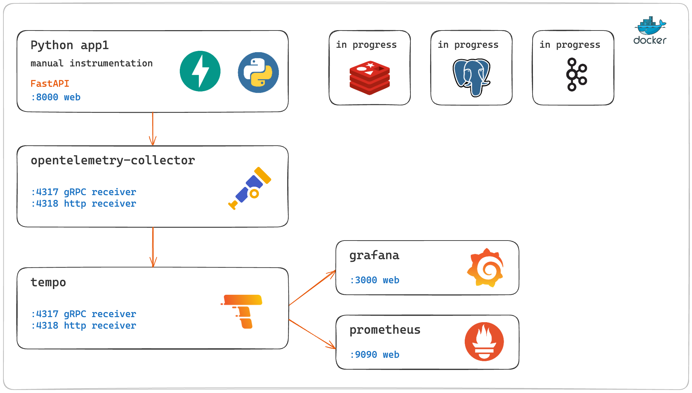

# Python tracing

To understand Tracing: 
- Python 
- OpenTelemetry 
- Tempo 
- Grafana
- Prometheus



### Useful materials
**main:**
- https://github.com/open-telemetry/opentelemetry-collector
- https://opentelemetry.io/docs/languages/python/getting-started/
- 

**web:**
- https://jorzel.hashnode.dev/understanding-distributed-tracing-a-python-guide-with-opentelemetry-and-grafana-tempo
- https://www.aspecto.io/blog/getting-started-with-opentelemetry-python/
- https://uptrace.dev/get/instrument/opentelemetry-fastapi.html#fastapi-instrumentation
- 

**github examples:**
- https://github.com/SigNoz/opentelemetry-python-example
- https://github.com/neverlock/python-opentelemetry-rabbitmq-tempo
- https://github.com/jorzel/tracing-otel
- https://github.com/softwarebloat/python-tracing-demo
- https://github.com/blueswen/fastapi-observability
- https://github.com/GRomR1/monitoring-microservices-demo
- https://github.com/lperdereau/opentelemetry-poc
- https://github.com/pasdam/playground-docker-grafana-prometheus-loki-tempo


### scripts:

```shell
k6 run scripts/k6_fastapi_get.js
```

### locahost services

Start
```
docker compose up -d
```

After run docker compose
- [Python_app1](http://localhost:8000)
- [Grafana](http://localhost:3000)
- [Prometheus](http://localhost:9090)
